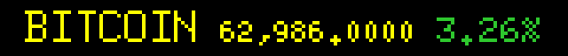

# led-ticker-crypto

A cryptocurrency price ticker **plugin** for [led-ticker](https://github.com/JamesAwesome/led-ticker), backed by the free CoinGecko v3 API. It contributes a `crypto.coingecko` **Container widget** that cycles one scrolling price line per configured coin — configure one coin for a single ticker, or a list to cycle through several.

Each line shows the coin symbol, current price (adaptive precision — sub-dollar tokens never collapse to `0.0000`), and 24-hour percent change. The change value is trend-colored: green for positive, red for negative, gray for neutral — readable at a glance on any panel.



## Prerequisites

- A working [led-ticker](https://github.com/JamesAwesome/led-ticker) install.
- Internet access on the Pi (the widget calls the CoinGecko public API).

## Install

The widget auto-registers via the `led_ticker.plugins` entry point — once the package is installed, no `[plugins]` config change is needed.

**Into a containerized led-ticker (recommended):** add this package to `config/requirements-plugins.txt` (copy it from `config/requirements-plugins.example.txt`, which already lists it), then rebuild:

```bash
# in your led-ticker checkout
cp config/requirements-plugins.example.txt config/requirements-plugins.txt
docker compose up -d --build
```

That example file lists every first-party plugin — trim the live copy to just the ones you want. The crypto line is:

```text
git+https://github.com/JamesAwesome/led-ticker-crypto.git@main
```

**Standalone (a venv that already has led-ticker):**

```bash
pip install "git+https://github.com/JamesAwesome/led-ticker-crypto.git@main"
```

led-ticker isn't on PyPI, so this path only works where led-ticker is already installed. See the led-ticker [Plugins docs](https://docs.ledticker.dev/plugins/) for the constraint-based install the Docker image uses.

## Configuration

Reference the widget in a playlist section by `type = "crypto.coingecko"`. Three coin-spec styles are supported — choose the one that fits your workflow:

### Single coin (legacy style)

```toml
[[playlist.section.widget]]
type = "crypto.coingecko"
symbol = "BTC"
symbol_id = "bitcoin"
currency = "USD"
```

### Multiple coins by explicit CoinGecko id

```toml
[[playlist.section.widget]]
type = "crypto.coingecko"
symbol_ids = ["bitcoin", "ethereum", "dogecoin"]
currency = "USD"
```

Each id in `symbol_ids` is also used as the on-panel label (uppercased). Use `symbol_ids` when you know the exact CoinGecko ids and want to skip the startup lookup.

### Multiple coins by ticker symbol (auto-resolved)

```toml
[[playlist.section.widget]]
type = "crypto.coingecko"
symbols = ["BTC", "ETH", "SOL"]
currency = "USD"
```

`symbols` are resolved at startup against CoinGecko's `/coins/list` endpoint. Resolution is **unique-or-error**: if a symbol matches more than one CoinGecko id, the widget fails at startup and lists the candidate ids — use `symbol_id` or `symbol_ids` to disambiguate.

You can combine all three styles in one widget; duplicates (by coin id) are silently dropped, keeping the first occurrence.

New to led-ticker configs? The [first-config tutorial](https://docs.ledticker.dev/tutorial/02-first-config/) walks through the overall structure — the blocks above show just the crypto-specific keys.

### Finding `symbol_id`

`symbol_id` is CoinGecko's internal coin identifier (e.g. `"bitcoin"`, `"ethereum"`, `"solana"`, `"dogecoin"`). It's the `id` field in CoinGecko's `/coins/list` endpoint and appears in a coin's page URL: `coingecko.com/en/coins/<id>`.

Use `symbol_id` (or `symbol_ids`) when:
- You want to skip the startup `/coins/list` lookup that `symbols` triggers.
- A symbol is ambiguous — the startup error lists the candidates and tells you which ids to use.

### Options

| Option | Type | Default | Description |
|--------|------|---------|-------------|
| `symbol` | string | — | Single-coin label shown on the panel (e.g. `"BTC"`). Requires `symbol_id`. |
| `symbol_id` | string | — | Single-coin CoinGecko id (e.g. `"bitcoin"`). Requires `symbol`. |
| `symbols` | list of strings | — | Ticker symbols auto-resolved to CoinGecko ids at startup (e.g. `["BTC", "ETH"]`). Unique-or-error. |
| `symbol_ids` | list of strings | — | CoinGecko ids used directly, uppercased as panel labels (e.g. `["bitcoin", "ethereum"]`). |
| `currency` | string | `"USD"` | Fiat currency code (e.g. `"USD"`, `"EUR"`). |
| `api_key` | string | `""` | CoinGecko free demo API key. Falls back to the `COINGECKO_API_KEY` env var. |
| `update_interval` | int | `300` | Seconds between CoinGecko fetches (5 min default). |
| `center` | bool | `true` | Center the ticker on the canvas when it fits; scroll when it overflows. |
| `padding` | int | `6` | Horizontal spacing (logical px) between the symbol, price, and change segments. |
| `hold_time` | float | `0.0` | Seconds to hold each coin's ticker before the engine cycles to the next. |
| `bg_color` | `[r,g,b]` | none | Background fill behind the ticker. |
| `font_color` | `[r,g,b]` / string / table | yellow `(255,255,0)` | Color for the symbol and price. Accepts any led-ticker color provider (e.g. `"rainbow"`, `{style="shimmer", ...}`). The 24h change color is always trend-colored and ignores this field. |

At least one of `symbol`+`symbol_id`, `symbols`, or `symbol_ids` must be specified — the widget fails at config validation otherwise.

### Rate limits & API key

CoinGecko's keyless free tier allows roughly **5 requests per minute**. For a single low-frequency widget at the default 5-minute interval this is plenty; if you add more coins or shorten `update_interval`, you may hit HTTP 429. When that happens the widget logs the rate-limit clearly and lets its monitor loop back off — it will not show stale garbage.

To raise the limit, create a free account at [coingecko.com](https://www.coingecko.com) and get a **Demo API key** (no credit card required). Supply it via the `api_key` config field or the `COINGECKO_API_KEY` environment variable:

```toml
[[playlist.section.widget]]
type = "crypto.coingecko"
symbols = ["BTC", "ETH", "SOL", "DOGE"]
currency = "USD"
api_key = "CG-xxxxxxxxxxxxxxxxxxxx"
```

The key is sent as the `x-cg-demo-api-key` request header.

## Development

led-ticker isn't on PyPI, so this plugin resolves it from a sibling checkout. Clone both side by side:

```
~/projects/.../led-ticker
~/projects/.../led-ticker-crypto
```

```bash
uv sync --extra dev      # resolves led-ticker from ../led-ticker
uv run pytest -q
uv run ruff check src tests
```

> **Note:** led-ticker's `graphics` surface works headless via its bundled stub, but the full `RGBMatrix`/canvas test stub lives in led-ticker's `tests/stubs/` and isn't shipped. This repo's tests put it on the path via `pyproject.toml`'s `[tool.pytest.ini_options] pythonpath = ["../led-ticker/tests/stubs"]`.

The plugin imports only the public `led_ticker.plugin` surface — `tests/test_import_purity.py` enforces it.

## Links

- [led-ticker](https://github.com/JamesAwesome/led-ticker) — the core project
- [Docs site](https://docs.ledticker.dev) · [Plugin system](https://docs.ledticker.dev/plugins/)
